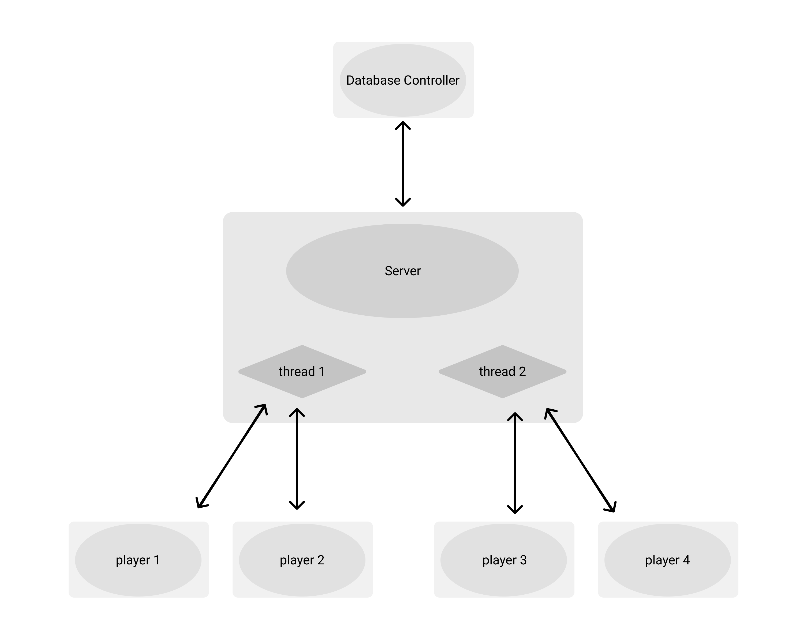

# HASH (Jogo da Velha)

## by: Otávio Goes

Um jogo multiusuário onde dois usuários podem se desafiar em uma partida de Jogo da Velha (Hash), o serviço será disponibilizado por um servidor que gerenciará as conexões e os dados das mesmas.

###### Tecnologias Usadas:

   - [C++](http://www.cplusplus.org/)

   - [wxWidgets](https://www.wxwidgets.org/)

   - [Protocol Buffers](https://developers.google.com/protocol-buffers)

   - [SQLite](https://www.sqlite.org/index.html)

###### Arquitetura do sistema

###### Documentação

   - [Modelos](docs/models.md)

   - [Interfaces](docs/interfaces.md)

   - [Execução](docs/execute.md)

Trabalho de conclusão da matéria de Sistemas Distribuídos (BCC36C)
